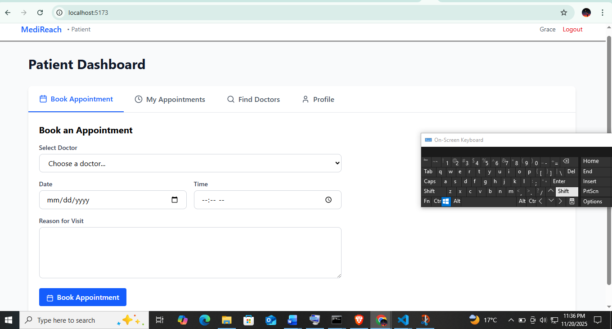

# MERN Stack Capstone Project


# 🏥 MediReach — MERN Healthcare Appointment System

MediReach is a full-stack healthcare appointment platform built using the MERN stack (MongoDB, Express.js, React.js, Node.js). It allows patients to register, log in, book appointments, view bookings, receive confirmations via email and SMS (Twilio), and interact with healthcare providers in a modern and user-friendly interface.

This project was developed as part of the **PLP MERN Stack Final Project**, demonstrating authentication, protected routes, API integration, and CRUD operations.

Designed for simplicity, automation, and accessibility, MediReach improves how patients connect with medical professionals—making healthcare more efficient and convenient.

## 🌐 Live Demo

**🔗 [View Live Application](https://medireach-ten.vercel.app/)** (Frontend - Vercel)

**🔗 Backend API:** https://medireach-backend-8ong.onrender.com (Render)

---

## 🚀 Features

### 👤 Authentication & Authorization
- Register as Patient or Doctor
- Login with JWT Authentication
- Protected Routes using Middleware

### 📅 Appointment Management
- Patients can book appointments
- Appointments are stored in MongoDB
- Users can view their appointments
- Email confirmation sent after successful booking

### 🏠 Patient Dashboard
After login, patients can:
- Access their profile information
- Navigate easily to booking and viewing appointments
- Manage their healthcare schedule in one place

The dashboard uses reusable components for a clean, modern UI.

### ✉️📱 Email & SMS Notifications (Nodemailer + Twilio)
After a successful booking, patients automatically receive:

**✔ Email Confirmation** (via Nodemailer)
- Doctor name
- Appointment date
- Appointment time

**✔ SMS Confirmation** (via Twilio)
- Appointment summary
- Quick confirmation message

This ensures that patients never miss their appointment details.

---

## 📂 Tech Stack

| Layer | Technology |
|-------|------------|
| Frontend | React, Vite, Tailwind CSS |
| Backend | Node.js, Express.js |
| Database | MongoDB + Mongoose |
| Authentication | JWT (JSON Web Tokens) |
| Email | Nodemailer |
| SMS | Twilio |
| Job Scheduling | node-cron |
| Version Control | Git & GitHub |

---

## 📁 Project Structure

```
MediReach-Project/
│
├── Backend/
│   ├── controllers/
│   ├── models/
│   ├── routes/
│   ├── middlewares/
│   ├── config/
│   ├── server.js
│   └── .env   (NOT committed to Git)
│
├── Frontend/
│   ├── src/
│   │   ├── components/
│   │   ├── context/
│   │   ├── pages/
│   │   ├── Dashboards/
│   │   ├── Hooks/
│   │   ├── services/
│   │   ├── App.jsx
│   │   └── main.jsx
│   └── vite.config.js
│
└── README.md
```

---

## 🔧 Setup Instructions

### ✅ 1. Clone the Repository

```bash
git clone https://github.com/PLP-MERN-Stack-Development/mern-final-project-Grace-Njoroge.git
cd mern-final-project-Grace-Njoroge
```

### 🖥 Backend Setup

#### ✅ 2. Navigate to Backend Folder
```bash
cd Backend
```

#### ✅ 3. Install Dependencies
```bash
npm install
```

#### ✅ 4. Create .env File
Create a `.env` file inside the `Backend` folder:

```env
PORT=5000
MONGO_URI=your-mongodb-connection-string
JWT_SECRET=your-secret-key
EMAIL_USER=your-email@example.com
EMAIL_PASS=your-email-password
TWILIO_ACCOUNT_SID=your-twilio-sid
TWILIO_AUTH_TOKEN=your-twilio-token
TWILIO_PHONE_NUMBER=your-twilio-phone
```

⚠️ **Do NOT push .env to GitHub.** Make sure it's added to `.gitignore`.

#### ✅ 5. Start Backend Server
```bash
npm start
```

Backend runs on: **http://localhost:5000**

---

### 🎨 Frontend Setup

#### ✅ 6. Navigate to Frontend Folder
```bash
cd ../Frontend
```

#### ✅ 7. Install Dependencies
```bash
npm install
```

#### ✅ 8. Setup Environment Variables
Create `Frontend/.env`:

```env
VITE_API_URL=http://localhost:5000/api
```

#### ✅ 9. Start Frontend
```bash
npm run dev
```

Frontend runs on: **http://localhost:5173**

---

## 🔗 API Endpoints

### Auth
| Method | Endpoint | Description |
|--------|----------|-------------|
| POST | `/api/users/register` | Register user |
| POST | `/api/users/login` | Login user |
| GET | `/api/users/profile` | Get profile (auth required) |

### Appointments
| Method | Endpoint | Description |
|--------|----------|-------------|
| GET | `/api/appointments` | Get all appointments |
| POST | `/api/appointments` | Create new appointment (auth required) |
| GET | `/api/appointments/:id` | Get single appointment |
| PUT | `/api/appointments/:id` | Update appointment (auth required) |
| DELETE | `/api/appointments/:id` | Delete appointment (auth required) |

---

## 🧪 Testing

**Backend:**
- Jest for unit testing
- Postman for API testing

**Frontend:**
- React Testing Library
- Cypress for E2E (optional)

---

## 🚀 Deployment

You can deploy:
- **Backend** → Render
- **Frontend** → Vercel
- **Database** → MongoDB Atlas

---

## 📸 Screenshots

- **Patient Dashboard**
-

-Book appointment interface with doctor selection, date, time, and reason for visit.

## 🤝 Contribution

Feel free to fork the project and submit pull requests for improvements.

---

## 📄 License

This project is for educational purposes under the PLP MERN Stack program.

---

## 👨‍💻 Author

**Grace Njoroge**

GitHub: [PLP-MERN-Stack-Development/mern-final-project-Grace-Njoroge](https://github.com/PLP-MERN-Stack-Development/mern-final-project-Grace-Njoroge)

---

## Resources

- [MongoDB Documentation](https://docs.mongodb.com/)
- [Express.js Documentation](https://expressjs.com/)
- [React Documentation](https://react.dev/)
- [Node.js Documentation](https://nodejs.org/en/docs/)
- [GitHub Classroom Guide](https://docs.github.com/en/education/manage-coursework-with-github-classroom) 
